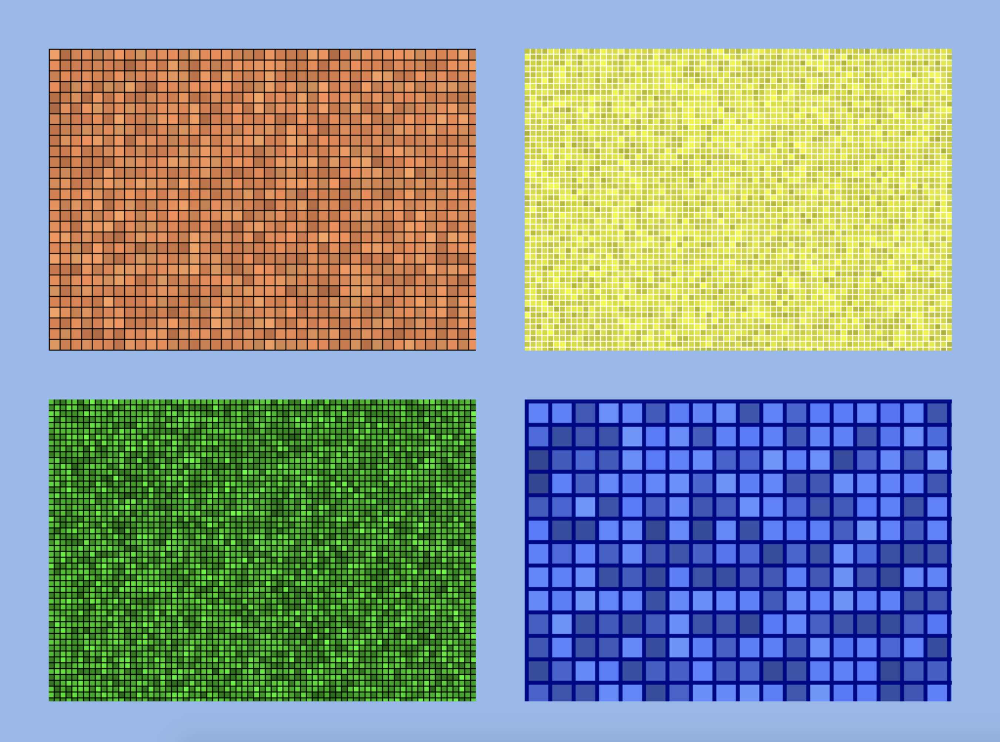

# Phaser 3 Plugin - MosaicView
This is a phaser 3 plugin for a customizable mosaic view. Use it to draw mosaic, with full control over tile size and color as well as color deviation including alpha. See usage for more information.



## Usage
```javascript
import 'phaser';
import MosaicViewPlugin from 'phaser3-plugin-mosiacview';

const game = new Phaser.Game({
  width: 1024,
  height: 768,
  backgroundColor: 0xffffff,
  scale: {
    mode: Phaser.Scale.FIT,
    autoCenter: Phaser.Scale.CENTER_BOTH
  },
  scene: {
    create: create,
  },
  plugins: {
    global: [{
      key: 'MosaicViewPlugin',
      plugin: MosaicViewPlugin,
      start: true
    }]
  }
});

function create() {
  this.add.mosaicView(0, 0, 200, 200, {
      tileWidth: 5,
      tileHeight: 5,
      padding: 1,
      startWithPadding: true,
      backgroundColor: 0x000000,
      color: 0xec844e,
      minColorDeviation: 0.1,
      maxColorDeviation: 0.2,
      minAlpha: 0.8,
      maxAlpha: 1
    });
}
```

## API
```javascript
// initialize plugin ...
// this.add.mosaicView(x, y, width, height, options)
const mosaicView = this.add.mosaicView(0, 0, 200, 200, {});
```

Options can be as follows: 

| Name              | Explanation                                                                                                                                                                               | Example    | Default    |
| :---------------- | :---------------------------------------------------------------------------------------------------------------------------------------------------------------------------------------- | :--------- | :--------- |
| tileWidth         | The width of a mosaic tile                                                                                                                                                                | `10`       | `10`       |
| tileHeight        | The height of a mosaic tile                                                                                                                                                               | `10`       | `10`       |
| padding           | The padding between mosaic tiles                                                                                                                                                          | `2`        | `2`        |
| color             | The base color of a mosaic tile. Must be a hex value                                                                                                                                      | `0xff0000` | `0x0000ff` |
| backgroundColor   | The background color of the view, where mosiac tiles are placed on                                                                                                                        | `0x000000` | `0x000000` |
| startWithPadding  | A flag indicating whether a padding should be drawn first. If set the first item drawn is a padding. If set to false a tile is drawn first                                                | `true`     | `false`    |
| minColorDeviation | A value between `0` and `1` indicating how strong the minimum color deviation is. For each mosaic tile a color devation is calculated between `minColorDeviation` and `maxColorDeviation` | `0`        | `0`        |
| maxColorDeviation | A value between `0` and `1` indicating how strong the maximum color deviation is. For each mosaic tile a color devation is calculated between `minColorDeviation` and `maxColorDeviation` | `1`        | `0`        |
| minAlpha          | A value between `0` and `1` indicating the minimum alpha value for a mosaic tile. For each mosaic tile an alpha value between `minAlpha` and `maxAlpha` is calculated                     | `0.75`     | `1`        |
| maxAlpha          | A value between `0` and `1` indicating the maximum alpha value for a mosaic tile. For each mosaic tile an alpha value between `minAlpha` and `maxAlpha` is calculated                     | `0.75`     | `1`        |

## Installation
```
npm i phaser3-plugin-mosaicview
```

Alternatively you can grab the latest distributed version directly from github via: [https://raw.githubusercontent.com/dasheck0/phaser3-plugin-mosaicview/master/dist/MosaicView.js](https://raw.githubusercontent.com/dasheck0/phaser3-plugin-mosaicview/master/dist/MosaicView.js)

## Contributing
Bug reports and pull requests are welcome on GitHub at [https://github.com/dasheck0/phaser3-plugin-mosaicview/pulls](https://github.com/dasheck0/phaser3-plugin-mosaicview/pulls). This project is intended to be a safe, welcoming space for collaboration, and contributors are expected to adhere to the Contributor Covenant code of conduct.

## License
``` 
MIT License

Copyright (c) 2020 Stefan Neidig

Permission is hereby granted, free of charge, to any person obtaining a copy
of this software and associated documentation files (the "Software"), to deal
in the Software without restriction, including without limitation the rights
to use, copy, modify, merge, publish, distribute, sublicense, and/or sell
copies of the Software, and to permit persons to whom the Software is
furnished to do so, subject to the following conditions:

The above copyright notice and this permission notice shall be included in all
copies or substantial portions of the Software.

THE SOFTWARE IS PROVIDED "AS IS", WITHOUT WARRANTY OF ANY KIND, EXPRESS OR
IMPLIED, INCLUDING BUT NOT LIMITED TO THE WARRANTIES OF MERCHANTABILITY,
FITNESS FOR A PARTICULAR PURPOSE AND NONINFRINGEMENT. IN NO EVENT SHALL THE
AUTHORS OR COPYRIGHT HOLDERS BE LIABLE FOR ANY CLAIM, DAMAGES OR OTHER
LIABILITY, WHETHER IN AN ACTION OF CONTRACT, TORT OR OTHERWISE, ARISING FROM,
OUT OF OR IN CONNECTION WITH THE SOFTWARE OR THE USE OR OTHER DEALINGS IN THE
SOFTWARE.

```
